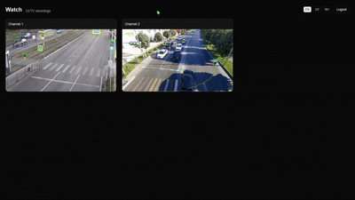

# CCTV Viewer

A minimal, secure CCTV viewing dashboard built with Next.js 15, React 19 and Tailwind CSS v4. It authenticates with credentials from `.env`, protects private routes via middleware, autodiscovers videos from `public/`, and supports English, Uzbek, and Russian.



### Features
- **Auth**: Username/password from `.env`, httpOnly session cookie, middleware-protected routes
- **CCTV Watch**: Grid of autoplaying, looping, muted videos from `public/` (recursively)
- **i18n**: EN / UZ / RU with on-page language switcher persisted via cookie
- **Clean UI**: Tailwind v4, responsive grid, logout control

### Tech
- Next.js 15 (App Router)
- React 19
- Tailwind CSS v4 (`@tailwindcss/postcss`)
- ESLint 9 (Next core web vitals)

---

## Getting Started

### 1) Install
```bash
npm i
```

### 2) Configure environment
Create a `.env` file at the project root (you can copy `.env.example`).
```env
ADMIN_USERNAME=admin
ADMIN_PASSWORD=changeme
```
Use strong values in production.

### 3) Run
```bash
npm run dev
# open http://localhost:3000
```

### 4) Build & start (production)
```bash
npm run build
npm start
```

---

## Usage
- Visit `/`:
  - Not logged in → redirected to `/login`
  - Logged in → redirected to `/watch`
- Sign in at `/login` using the credentials from `.env`
- Watch grid at `/watch`
- Logout via the header control (links to `/api/logout`)

### Language switching
- Toggle EN / UZ / RU from the header (or login page).
- Selected locale is stored in a `lang` cookie and applied to the page.

## How it works

### Auth & middleware
- `POST /api/login`: validates credentials from `.env`, sets `session` httpOnly cookie containing a SHA-256 digest of `username|password`.
- `GET /api/logout`: clears the session cookie and redirects to `/login`.
- `middleware.js`: protects `/watch` and `/admin/*`, redirects `/` based on login state.

### i18n
- Language files in `src/i18n`: `en.json`, `uz.json`, `ru.json`.
- `lang` cookie controls the UI language; switcher writes the cookie client-side and triggers a soft refresh.

### Video discovery
- Server components (`/watch`) read `public/` recursively, normalize Windows paths, and render a responsive grid.

---

## Scripts
- `npm run dev` – start dev server (Turbopack)
- `npm run build` – production build
- `npm start` – start production server
- `npm run lint` – run ESLint

---

## Project Structure (excerpt)
```
src/
  app/
    api/
      login/route.js
      logout/route.js
      lang/route.js
    login/page.js
    watch/page.js
    layout.js
  components/
    LanguageSwitcher.js
  i18n/
    en.json
    uz.json
    ru.json
    config.js
public/
  demo.gif
```

---

## Notes for production
- Set strong `ADMIN_USERNAME` and `ADMIN_PASSWORD` values
- Serve over HTTPS so cookies can be marked `secure`
- Keep videos in a storage bucket/CDN if `public/` becomes large